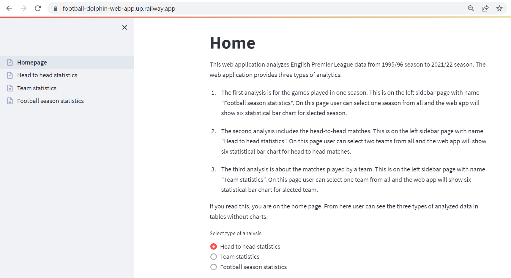

# Football-Dolphin-API

**Football Dolphin Project = Football Dolphin API + Football Dolphin Web App**

The project **“Football Dolphin”** analyzes database with 10 260 football matches and provides statistics about the total number of played matches in English Premier League from season 1995/ 96 to season 2021/ 22. Тhe main concept of the project is the calculation of the total number of played matches by “Team”, “Season” and “Head to Head” in different types of statistics (Table 1).

The best way to understand something is when you test it. Please try **Football Dolphin API** and **Football Dolphin Web App** on the links below.

**1. Football Dolphin API**: 

**1. 1. RapidAPI Hub:** https://rapidapi.com/georgievdatascience-bYAvW_z25SU/api/football-dolphin

**1. 2. Source Code:** https://github.com/GeorgievDataScience/Football-Dolphin-API

#
If you want to see all **Football Dolphin API** endpoints in DataFrames and Diagrams, you can visit **Football Dolphin Web App**.
#

**2. Football Dolphin Web App**: 

**2.1. Web App:** https://football-dolphin-web-app.up.railway.app/

**2.2. Source Code:** https://github.com/GeorgievDataScience/Football-Dolphin-Web-App
